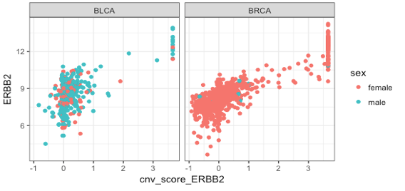

<!-- README.md is generated from README.Rmd. Please edit that file -->

# FacileData

<!-- badges: start -->

[](https://github.com/facilebio/FacileData/actions)

[](http://www.repostatus.org/#active)
[](https://www.tidyverse.org/lifecycle/#maturing)
[](https://codecov.io/gh/facilebio/FacileData)
<!-- badges: end -->

The `FacileData` package was written to facilitate easier analysis of
large, multi-assay high-throughput genomics datasets. To this end, the
`FacileData` package provides two things:

1.  A *FacileData Access API* that defines a fluent interface over
    multi-assay genomics datasets that fits into the
    [tidyverse](https://www.tidyverse.org/). This enables analysts to
    more naturally query and retrieve data for general exploratory data
    analysis; and
2.  A reference implementation of a datastore that implements the
    *FacileData Access API* called a *FacileDataSet*. The
    `FacileDataSet` provides efficient storage and retrieval of
    arbitrarily large high-throughput genomics datasets. For example, a
    single `FacileDataSet` can be used to store *all* of the RNA-seq,
    microarray, RPPA, etc. data from the [The Cancer Genome
    Atlas](https://cancergenome.nih.gov/). This singular `FacileDataSet`
    allows analysts easy access to arbitrary subsets of these data
    without having to load all of it into memory.

# Installation

The FacileData suite of packages is only available from github from now.
You will want to install three `FacileData*` packages to appreciate the
its utility:

``` r
# install.packages("devtools")
devtools::install_github("facilebio/FacileData")
```

# Example Usage

As a teaser, we’ll show how to plot HER2 copy number vs expression
across the TCGA bladder and breast indications (“BLCA” and “BRCA”) using
a `FacileDataSet`.

``` r
library(ggplot2)
library(FacileData)
library(FacileTCGADataSet)
tcga <- FacileTCGADataSet()

features <- filter_features(tcga, name == "ERBB2")

fdat <- tcga |>
  filter_samples(indication %in% c("BLCA", "BRCA")) |>
  with_assay_data(features, assay_name = "rnaseq", normalized = TRUE) |>
  with_assay_data(features, assay_name = "cnv_score") |>
  with_sample_covariates(c("indication", "sex"))

ggplot(fdat, aes(cnv_score_ERBB2, ERBB2, color = sex)) +
  geom_point() +
  facet_wrap(~ indication)
```



Let’s compare how you might do the same using data stored in a
`SummarizedExperiment` named `se.tcga` that stores RNA-seq (raw and
normalized) and copy number data.

``` r
# load / get `se.all` from somewhere
fidx <- which(mcols(se.all)$name == "ERBB2")
se <- se.all[, se.all$indication %in% c("BLCA", "BRCA")]

sdat <- data.frame(
  ERBB2 = assay(se, "rnaseq_norm")[fidx,],
  cnv_score_ERBB2 = assay(se, "cnv_score")[fidx,],
  sex = se$sex,
  indication = se$indication)

ggplot(fdat, aes(cnv_score_ERBB2, ERBB2, color=sex)) +
  geom_point() +
  facet_wrap(~ indication)
```

TODO: Show same analysis using MultiAssayEperiment
